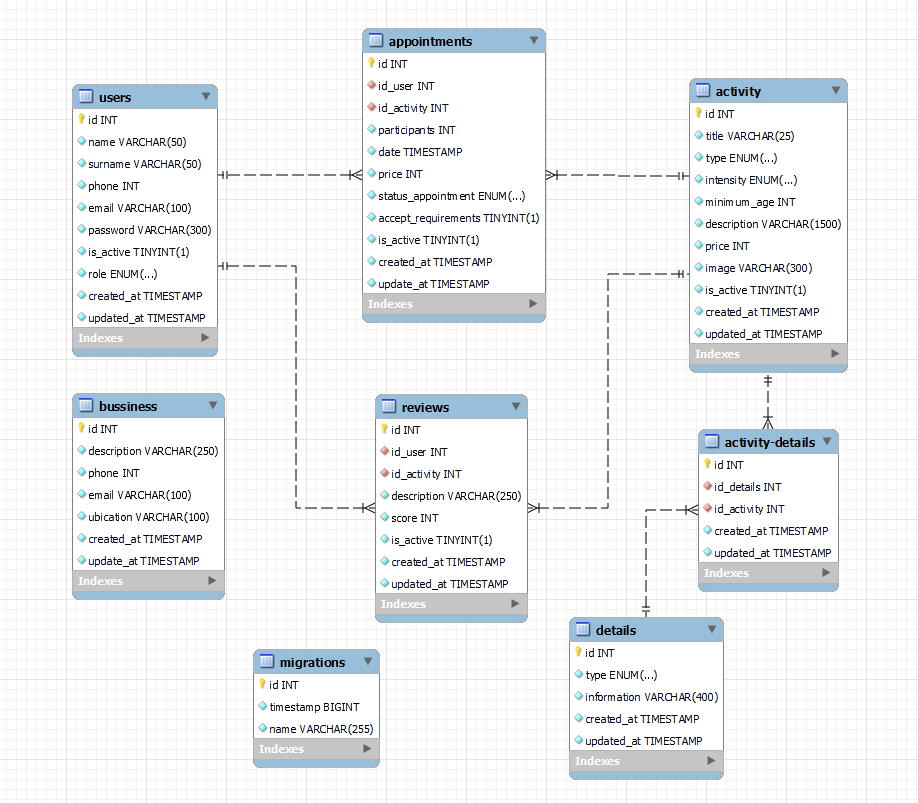

>[!NOTE]
>Soy una nota
# <h1 align="center">README -  Dinamic Adventure </h1>
__
Proyecto Final - Full Stack Developer Bootcamp en GeeksHubs Academy 
__

   

      
   
    

## 📋 Contenido del Readme

 
Accede al contenido del Readme

- <a href="#🚀-descripción"><h4>🚀 Descripción</h4></a>
- <a href="#🎯-objetivo"><h4>🎯 Objetivo</h4></a>
- <a href="#🛠️-tecnologías-utilizadas"><h4>🛠️ Tecnologías utilizadas</h4></a>
- <a href="#📉-diagrama-de-la-base-de-datos"><h4>📉 Diagrama de la base de datos</h4></a>
- <a href="#💡endpoints"><h4>💡 Endpoints</h4></a>
- <a href="#⚙️-instrucciones-de-uso"><h4>⚙️ Instrucciones de uso</h4></a>
- <a href="#📅-organización"><h4>📅 Organización</h4></a>
- <a href="#👏-agradecimientos"><h4>👏 Agradecimientos</h4></a>
- <a href="#🌟-mejoras"><h4>🌟 Mejoras</h4></a>
- <a href="#📧-contacto"><h4>📧 Contacto</h4></a>

## 🚀 Descripción

Este proyecto del Bootcamp Full Stack está enfocado en backend de una empresa de deportes de aventura, haciendo uso de tecnologías como Node.js, TypeScript, Express, MySQL, GIT y GitHub.  El desarrollo de este proyecto se basa en una base de datos relacional gestionada con TypeORM.
 
La aplicación busca superar las limitaciones actuales de la plataforma, transformándola en una herramienta completa que no solo permite a los usuarios visualizar las actividades, sino que permite registrar un usuario, comprobar la disponibilidad, reservar una actividad y como consecuencia, optimiza la gestión interna, reduciendo significativamente la carga administrativa.
El enfoque principal es crear un backend eficiente y escalable que permita a los usuarios visualizar, comprobar la disponibilidad, registrarse en la plataforma y reservar actividades de manera óptima.

      
      <em>Vista de la plataforma previa al proyecto</em>
   

## 🎯 Objetivo

El proyecto de Dinamic Adventure tiene como objetivo principal desarrollar un sistema backend sólido y completo destinado a gestionar las actividades de turismo activo. Los objetivos específicos son los siguientes:

- **Desarrollar una API robusta**: Crear una API escalable y segura que permita a los usuarios interactuar con el sistema de reservas, facilitando tanto a los clientes como a los empleados la gestión eficiente de las actividades.

- **Gestión de usuarios:** Implementar funciones completas para administrar los usuarios, abarcando desde el registro hasta la actualización de datos personales. Esto garantiza una experiencia de usuario fluida y personalizada.

- **Gestión de reservas:** Facilitar a los clientes la visualización, modificación y cancelación de sus reservas, optimizando el proceso y mejorando la experiencia del usuario.

- **Optimización interna:** Automatizar la gestión de las actividades y estados de las reservas. 

En resumen, el proyecto tiene como objetivo principal la creación de un sistema completo de gestión de actividades para la empresa, Dinamic Adventure, asegurando una experiencia de usuario intuitiva y segura tanto para clientes como para la empresa.

## 🛠️ Tecnologías Utilizadas
Para desarrollar este proyecto, he hecho uso de las siguientes tecnologías:

  
  

## 📉 Diagrama de la base de datos

   

      
   
    
   

    <em>Diseño de la base de datos</em>
    
  

## 💡Endpoints

### /user
 
1. Registro.
    - Descripción: Crear un nuevo usuario, recuperando la información de los campos requeridos a través del body. Y, se genera un registro en la base de datos de un nuevo usuario con el rol de "user".

            POST localhost:4000/user/register

        Body:

             JSON
            {
               "name": "Marta",
               "surname": "Guillem Olmos",
               "phome":627840804,
               "email": "martaguillem@outlook.es",
               "password": "123456"
            }
        
2. Login.
    - Descripción: Al acceder, nos devuelve un token a través del body que utilizaremos más tarde en las rutas habilitadas para los usuarios.

            POST localhost:4000/user 

        Body:

             JSON
            {
                "email": "martaguillem@outlook.es",
                "password": "123456"
            }

3. Perfil.
    - Descripción: Obtener un usuario por el id del token que hemos obtenido con el Login.

            GET localhost:4000/user/profile  

        Auth:

            Auth : User 
            Barer token : Token
 
4. Modificar los datos del usuario.
    - Descripción: Modificamos los datos del usuario a través del id que tenemos almacenado en redux.

            PUT localhost:4000/user

        Auth:

            Auth : User 
            Barer token : Token
       
        Body:

            JSON
            {
                "name": "Marta",
                "email": "martaguillem@outlook.es",
                "surname": "Guillem",
                "phone": 627840804,              
            }

>[!NOTE]
>Estos son todos los campos que podemos modificar de nuestro perfil. No obstante, podemos modificar uno o más campos; no es necesario enviarlos todos para que se procese la solicitud.

5. Modificar el password.
    - Descripción: Creamos una ruta única para modificar el password. 
    Antes de realizar la modificación, solicitamos a través del body nueva contraseña y la antigua para comprobar que es la misma que teníamos almacenada en la base de datos y procesar la solicitud.

            PATCH localhost:4000/user/password

        Auth:

            Auth : User 
            Barer token : Token
       
        Body:

            JSON
            {
                "password": "1234567",
                "passwordOld": "123456"             
            }

>[!NOTE]
>Antes de realizar la llamada a la base de datos, comprobamos que la nueva contraeña no sea igual a la que queremos modificar, para evitar una llamada inecesaria a la API.

6. Inactivar una cuenta.
    - Descripción: Hemos creado una ruta única para inactivar la cuenta. Recuperamos el id del usuario a través del token almacenado en redux.

            PUT localhost:4000/user/account

        Auth:

            Auth : User 
            Barer token : Token
       
        Body:

            JSON
            {
                "is_active": "false"            
            }

>[!IMPORTANT]
>Para poder acceder a todas las rutas que requieren de token, se comprueba previamente si el token está activo o no. En el caso que el usuario inactive la cuenta no podrá acceder a ninguna de esas vistas.

7. Obtener todos los usuarios.
    - Descripción: Obtener los datos de todos los usuarios.

            GET localhost:4000/user

### /activity
 

1. Crear una actividad.
    - Descripción: Creamos una nueva actividad, recuperando la información de los campos requeridos a través del body.

            POST localhost:4000/activity

        Body:

             JSON
            {
                "title": "Rafting",
                "type": "acuatica",
                "intensity": "medium",
                "minimum_age": 9,
                "description": "La mejor actividad",
                "price": 30,
                "image": "https://t4.ftcdn.net/jpg/00/64/67/63/360_F_64676383_LdbmhiNM6Ypzb3FM4PPuFP9rHe7ri8Ju.webp"
            }
        
2. Recuperar una actividad.
    - Descripción: Obtenemos una actividad a través del id que obtenemos a través del body.

            POST localhost:4000/activity 

        Body:

             JSON
            {
                "id": 1
            }

3. Recuperamos las actividades según el tipo.
    - Descripción: Contamos con dos tipos de actividades, terrestres o acuáticas. El tipo de actividad se recupera a través del body.

            GET localhost:4000/activity/type 

        Body:

             JSON
            {
                "type": "acuatica"
            }
 
4. Recuperamos todas las actividades.
    - Descripción: Recuperamos todas las actividades que tenemos almacenadas en la base de datos sin restricciones.

            GET localhost:4000/activity/all

5. Modificar los datos de la actividad.
    - Descripción: Modificamos los datos de la actividad a través del id que hemos recuperado a través del body.

            PUT localhost:4000/activity
       
        Body:

            JSON
            {
                "id": "1",
                "title": "Rafting de aguas bravas",
                "type": "acuatica",
                "intensity": "medium",
                "minimum_age": 9,
                "description": "La mejor actividad",
                "price": 30,
                "image": "https://t4.ftcdn.net/jpg/00/64/67/63/360_F_64676383_LdbmhiNM6Ypzb3FM4PPuFP9rHe7ri8Ju.webp"             
            }

>[!NOTE]
>Estos son todos los campos que podemos modificar. No obstante, podemos modificar uno o más campos; no es necesario enviarlos todos para que se procese la solicitud.

6. Eliminar una actividad.
    - Descripción: Eliminamos una actividad por su id, este lo recuperamos a través del body.

            DELETE localhost:4000/activity

        Body:

            JSON
            {
                "id": "1"           
            }

### /details
 

1. Crear un detalle.
    - Descripción: Creamos un nuevo detalle, recuperando la información de los campos requeridos a través del body.

            POST localhost:4000/details

        Body:

             JSON
            {
                "type": "details",
                "information": "Soy el detalle de la iformacion, aqui va el primero, flipa"
            }
>[!NOTE]
>En el caso que ya exista un detalle ya en nuestra base de datos con las mismas características no se realizará la solicitud.
        
2. Recuperar un detalle.
    - Descripción: Obtenemos un detalle a través del id que obtenemos a través del body.

            POST localhost:4000/details 

        Body:

             JSON
            {
                "id": 1
            }

3. Recuperamos las actividades según el tipo.
    - Descripción: Contamos tres tipos; "requiriments", "details", "itinerary". El tipo se recupera a través del body.

            GET localhost:4000/details/type 

        Body:

             JSON
            {
                "type": "details"
            }
 
4. Recuperamos todos los detalles.
    - Descripción: Recuperamos todos los detalles que tenemos almacenadas en la base de datos sin restricciones.

            GET localhost:4000/details/all

5. Modificar un detalle por el Id.
    - Descripción: Modificamos los datos del detalle a través del id que hemos recuperado a través del body.

            PUT localhost:4000/details
       
        Body:

            JSON
            {
                "id": "9",
                "type": "itinerary",
                "information": "9.00h Quedamos con vosotros en nuestras instalaciones."
            }

>[!NOTE]
>Estos son todos los campos que podemos modificar. No obstante, podemos modificar uno o más campos; no es necesario enviarlos todos para que se procese la solicitud.

6. Eliminar un detalle.
    - Descripción: Eliminamos un detalle por su id, este lo recuperamos a través del body.

            DELETE localhost:4000/details

        Body:

            JSON
            {
                "id": "1"           
            }

## ⚙️ Instrucciones de uso

1. Clona este repositorio en tu máquina local usando el siguiente comando: `git clone [URL del repositorio]`.
2. A continuación instala todas las dependencias con el comando `npm install`.
3. Conectamos nuestro repositorio con la base de datos mediante las credenciales en el archivo db.ts o, en este caso, con las variables de entorno que se encuentran en el archivo .env.example.

  
        PORT = 
            
        DB_TYPE = 
        DB_HOST =
        DB_PORT = 
        DB_USERNAME =
        DB_PASSWORD = 
        DB_NAME = 

        JWT_SECRET = 
    
4. Crea el archivo .env e indica las variables anteriores.

5. Ejecutamos las migraciones mediante el comando `npx typeorm-ts-node-commonjs migration:run -d ./src/db.ts` 
6. Si estamos en desarrollo, lo hacemos funcionar y actualizarse en tiempo real mediante el comando `npm run dev`
7. Si queremos compilar usamos el comando `npm run build`
8. Si estamos en producción, lo ponemos en marcha con el comando `npm run start`
9. Usamos los endpoints almacenados en la carpeta http para usar las distintas funcionalidades que se han diseñado.
10. Importar endpoints con Postman.
- En la carpeta /http se encuentra el archivo para importar todas las rutas a través de Postman:

    

<em>Acceder al archivo de Postman</em>

- Por último, importa el documento en Postman.

<em>Importamos el documento en Postman.</em>

## 📅 Organización
Para llevar a cabo este proyecto he utilizado las siguientes herramientas:
- <strong>Trello 🖇️</strong>

    
   

   <em>Disposición del tablón,</em>
      <a href = "https://trello.com/invite/b/2sgYNf7n/ATTI9b0d30dde3135781a2a8f2e3c74126694B79607A/proyecto-final-bootcamp-full-stack-devoloper">accede a él en Trello.</a>

 
- <strong>Ramas en el repositorio</strong> 🪴

- La estructura del respositorio está compuesta por cinco ramas:
    - <strong>Master</strong>: Rama principal del proyecto.
    - <strong>Dev</strong>: Rama en la que se combinan los trabajos de las otras ramas y se testean antes de pasarse a producción.

    
   

   <em>Repositorio de GitHub</em>

## 👏 Agradecimientos
Este proyecto es el reflejo de todos los conocimientos que hemos adquirido hasta la fecha en el BootCamp FullStack Developer.

## 🌟 Mejoras

## 📧 Contacto
Contacta conmigo por correo electrónico [martaguillem@outlook.es](mailto:martaguillem@outlook.es). Además, puedes seguirme en:
  
 - [GitHub]((https://github.com/martaguillemolmos))   | [LinkedIn](https://www.linkedin.com/in/marta-guillem-olmos-b26b9b293/)
